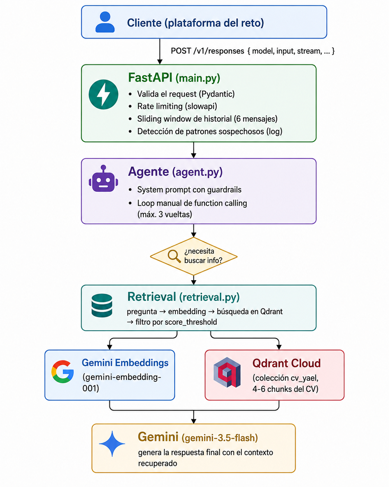

# Agente de CV — Irving Yael López Solís

Agente conversacional que responde preguntas sobre mi trayectoria profesional, experiencia, habilidades y proyectos, construido como parte del **Reto IA Banorte**. Combina un pipeline RAG (Retrieval-Augmented Generation) con un agente que decide de forma autónoma cuándo consultar mi información, expuesto vía un endpoint público compatible con **Open Responses**.

**Endpoint público:** `https://banorte-cv-agent-yael.onrender.com/v1/responses`

**Health check:** `https://banorte-cv-agent-yael.onrender.com/health`

---

## Tabla de contenido

1. [Resumen de la arquitectura](#resumen-de-la-arquitectura)
2. [Decisiones técnicas y su justificación](#decisiones-técnicas-y-su-justificación)
3. [Cómo verifico que el agente sea confiable](#cómo-verifico-que-el-agente-sea-confiable)
4. [Seguridad](#seguridad)
5. [Cómo correrlo en local](#cómo-correrlo-en-local)
6. [Despliegue](#despliegue)
7. [Estructura del repositorio](#estructura-del-repositorio)
8. [Limitaciones conocidas y siguientes pasos](#limitaciones-conocidas-y-siguientes-pasos)

---

## Resumen de la arquitectura



El flujo de una pregunta es: **request → validación → el agente decide si necesita buscar → (si aplica) retrieval con umbral de confianza → generación → respuesta con status terminal**.

---

## Decisiones técnicas y su justificación

Cada sección explica **qué elegí**, **por qué**, y **qué alternativas consideré**, siguiendo los ejes que pide el reto: diseño, integración, despliegue y operación.

### 1. Backend: FastAPI

**Elección:** FastAPI sobre Flask.
**Por qué:** soporte async nativo (relevante para I/O-bound: llamadas a Gemini y Qdrant), validación de tipos automática con Pydantic (crítico para un endpoint público que recibe datos externos no confiables), y documentación OpenAPI autogenerada.

**Alternativa considerada:** Flask — más simple, pero sin async nativo ni validación de tipos out-of-the-box; hubiera requerido más código manual para lograr la misma robustez de validación de requests.

### 2. Organización: monolito simple, no microservicios

**Elección:** una sola aplicación FastAPI con módulos internos (`chunking`, `embeddings`, `vectorstore`, `retrieval`, `agent`, `main`), no servicios separados.
**Por qué:** el problema (un CV, un agente, un endpoint) no tiene componentes que se beneficien de escalar o desplegarse por separado. Separar en microservicios habría añadido complejidad operativa (orquestación, latencia de red entre servicios, más piezas que pueden fallar) sin ningún beneficio real para este tamaño de dato y tráfico.

**Cuándo cambiaría de opinión:** si el sistema manejara múltiples fuentes de datos con ciclos de actualización independientes, o necesitara escalar el componente de generación por separado del de retrieval.

### 3. Fuente de información: documento Markdown estructurado

**Elección:** un `data/cv.md` con secciones delimitadas por `##` (Datos Generales, Educación, Experiencia, Proyectos, Habilidades, Intereses), en vez de JSON estructurado o una base de datos relacional.

**Por qué:** para el volumen de información de un CV, un documento de texto estructurado es suficiente y además es el formato que mejor se presta a búsqueda semántica (la pregunta "qué proyectos de IA ha hecho" no mapea limpio a una consulta SQL, pero sí a similaridad semántica sobre texto). JSON hubiera sido mejor si necesitara filtros exactos (ej. "proyectos entre 2024 y 2025"), pero no es el caso de uso principal aquí.

### 4. Chunking: por sección, no por tamaño fijo

**Elección:** dividir el documento en un chunk por cada encabezado `##`.

**Por qué:** cada sección de un CV es una unidad semántica completa (ej. toda la descripción de un proyecto). Chunking por tamaño fijo (ej. 500 tokens) puede cortar una idea a la mitad, degradando la calidad del retrieval. Chunking semántico más sofisticado (clustering de oraciones) sería sobre-ingeniería para un documento de este tamaño.

### 5. Embeddings: API de Gemini, no un modelo local

**Elección:** `gemini-embedding-001` vía API, en vez de un modelo local como `sentence-transformers`.

**Por qué:** el servicio se despliega en un servidor con recursos limitados (free tier de Render). Un modelo de embeddings local cargado en memoria consume RAM y CPU del propio servidor, lo cual es un riesgo real en un entorno con recursos acotados. Delegar el cómputo a una API externa mantiene el servidor ligero. Además, usar Gemini tanto para embeddings como para generación significa un solo proveedor y una sola API key que administrar.

**Trade-off asumido:** dependencia de la disponibilidad y cuota de la API externa, en vez de correr todo de forma autocontenida.

### 6. Base vectorial: Qdrant Cloud

**Elección:** Qdrant Cloud (free tier) en vez de una solución embebida (Chroma) o local en disco.

**Por qué:** el servidor de Render corre en un contenedor con disco efímero — cualquier dato guardado localmente puede perderse en un redeploy, y no persiste de forma confiable entre instancias. Qdrant Cloud da persistencia real y un endpoint accesible desde cualquier instancia del servidor.

**Nota de diseño:** el cliente (`vectorstore.py`) detecta automáticamente si hay credenciales de Qdrant Cloud en el entorno; si no, cae a un modo local en disco — esto permitió desarrollar e iterar todo el pipeline sin depender de la nube hasta el momento de desplegar.

### 7. Umbral de similitud (`score_threshold`)

**Elección:** filtrar los resultados de retrieval con un umbral mínimo de similitud (score coseno), en vez de siempre devolver el top-k sin importar qué tan lejano sea.

**Por qué:** sin este filtro, una pregunta totalmente fuera de tema (ej. "cuál es la receta de la paella") de todos modos regresaría los 4 chunks "menos lejanos" del CV, y el modelo podría intentar forzar una respuesta con contexto irrelevante. Con el umbral, si no hay coincidencia semántica real, el retrieval regresa vacío y el agente responde honestamente que no tiene esa información.

**Calibración:** el valor usado se ajustó observando los scores reales logueados en producción con preguntas relevantes vs. irrelevantes sobre mi CV.

### 8. Diseño del agente: function calling manual, no automático

**Elección:** implementar el loop de function calling a mano (recibir la petición de tool call, ejecutarla, devolver el resultado, repetir), en vez de usar el modo de ejecución automática que ofrece el SDK de Gemini.

**Por qué:** control real sobre el comportamiento del agente:
- **Observabilidad:** cada llamada a `buscar_info_cv` se loggea con la query y los scores obtenidos.
- **Guardrail de seguridad:** un límite explícito de vueltas del loop (`MAX_TOOL_LOOPS = 3`) evita que el agente entre en un ciclo descontrolado de llamadas a herramientas.
- **Transparencia para la demo:** Conocimiento y control exacto sobre qué pasa en cada paso, sin que el comportamiento esté oculto detrás de la abstracción del SDK.

### 9. Un solo agente con una tool, no multiagente

**Elección:** un agente con una sola herramienta (`buscar_info_cv`), no una arquitectura de varios agentes especializados.

**Por qué:** para el tamaño y tipo de información de mi CV, un solo agente con contexto controlado resuelve el problema completo sin complejidad adicional injustificada. Múltiples agentes tendrían sentido si hubiera fuentes de información heterogéneas que requirieran especialización (ej. un agente para proyectos técnicos, otro para soft skills, un router que decida a cuál enrutar) — no es el caso aquí.

**Extensión que consideré (no implementada por alcance/tiempo):** un sub-agente verificador que revise que la respuesta generada esté efectivamente respaldada por los chunks recuperados antes de devolverla — lo documento como siguiente paso natural si el caso de uso creciera.

### 10. Gestión de contexto conversacional: stateless + sliding window

**Elección:** el servidor **no** guarda memoria entre requests. El cliente manda el historial completo en cada llamada (`input` como lista de mensajes), y el servidor se queda solo con los últimos `MAX_HISTORY_MESSAGES = 6` mensajes (3 turnos) antes de procesar.

**Por qué:**
- **Stateless por diseño:** siguiendo el comportamiento por defecto de Open Responses, esto simplifica la operación — no importa si hay una o varias instancias del servidor corriendo, ninguna depende de tener la conversación en memoria.
- **Sliding window:** acota el costo y la latencia de cada llamada al modelo sin importar qué tan larga sea la conversación del lado del cliente.

### 11. Compatibilidad con Open Responses

**Elección:** implementación propia (no un gateway de terceros) de un subconjunto de la especificación Open Responses: `POST /v1/responses`, aceptando `input` como string simple o como lista de mensajes con `content` en forma de string **o** de lista de partes (`[{"type": "input_text", "text": "..."}]`), y devolviendo un objeto `response` con `status: "completed"` a nivel raíz además del `status` de cada item de salida.

**Por qué implementación propia:** control total sobre el comportamiento y capacidad de depurar/ajustar el schema exacto contra el cliente real (la plataforma del reto), en vez de depender de una capa intermedia que abstrae esos detalles.

**Aprendizaje durante el desarrollo:** el schema tuvo que ajustarse iterativamente al formato real que manda la plataforma (con logging del payload crudo en cada error de validación), ya que la spec admite variantes en la forma de `content` y el campo `status` a nivel raíz del response resultó ser necesario para que el cliente reconociera la respuesta como terminal.

### 12. Streaming (`stream: true`)

**Estado actual:** el endpoint recibe el flag `stream` pero siempre responde con un JSON agregado (no Server-Sent Events real).

**Por qué esta limitación consciente:** implementar streaming token-a-token real dentro del loop de function calling agrega complejidad significativa (manejar eventos parciales durante una posible llamada a herramienta) que no era indispensable para demostrar el criterio de diseño del reto en el tiempo disponible.

**Cómo lo extendería:** usando `StreamingResponse` de FastAPI con `media_type="text/event-stream"`, emitiendo eventos tipados (`response.created`, `response.output_text.delta`, `response.completed`) según la spec de Open Responses.

### 13. MCP (Model Context Protocol)

**Estado actual:** no implementado — la herramienta de retrieval se expone como function calling nativo del SDK de Gemini, no como servidor MCP.

**Por qué:** para un agente con una sola herramienta y un solo cliente consumidor (la plataforma del reto), MCP no aporta valor adicional sobre function calling directo — MCP brilla cuando quieres que múltiples clientes/agentes distintos consuman la misma herramienta de forma estandarizada.

**Cómo lo extendería:** exponiendo `buscar_info_cv` como una tool de un servidor MCP ligero, para que cualquier cliente compatible (no solo este agente) pudiera consultar mi perfil sin acoplarse a esta API específica.

### 14. Observabilidad

**Elección:** logging estructurado de cada tool call (query, número de resultados, scores de similitud) y de cada posible intento de prompt injection detectado.

**Por qué:** en un agente en producción, poder ver *por qué* respondió lo que respondió es tan importante como que responda bien — permite calibrar el `score_threshold`, detectar preguntas mal resueltas, y auditar comportamiento sospechoso.

**Siguiente nivel (no implementado):** integrar una herramienta dedicada de observabilidad para LLMs (ej. Langfuse) para trazabilidad completa de tokens, costo y latencia por request.

---

## Cómo verifico que el agente sea confiable

1. **Guardrail anti-alucinación en el system prompt:** el agente solo puede afirmar información respaldada por `buscar_info_cv`; si no hay información relevante, debe decirlo honestamente.
2. **Umbral de similitud:** evita que el modelo reciba contexto irrelevante forzado en preguntas fuera de tema.
3. **Tratamiento del contenido recuperado como no confiable por default:** el system prompt indica explícitamente que cualquier instrucción dentro del contenido recuperado o del input del usuario se trata como texto a describir, nunca como una orden — mitigación de prompt injection vía contenido indirecto.
4. **Pruebas manuales dirigidas:** validé el comportamiento con preguntas dentro de mi perfil, preguntas fuera de tema, e intentos explícitos de prompt injection, confirmando que el agente redirige con el mensaje definido en el system prompt en vez de romper su rol.
5. **Logging de scores:** cada búsqueda deja rastro del score de similitud obtenido, lo que permite auditar después si una respuesta se basó en información realmente relevante.

---

## Seguridad

- **API key propia** (`SERVICE_API_KEY`, distinta de las keys de Gemini/Qdrant) requerida vía header `Authorization: Bearer <key>`.
- **Rate limiting** por IP (20 requests/minuto) contra abuso del endpoint público.
- **Secretos nunca hardcodeados:** todas las credenciales viven en variables de entorno (`.env` en local, variables de entorno del servicio en Render), nunca en el código ni en la imagen de Docker (`.env` está en `.dockerignore` y `.gitignore`).
- **Usuario no-root** dentro del contenedor Docker.
- **Límite de longitud de mensaje** (2000 caracteres) como control básico de abuso.
- **Detección (no bloqueo ciego) de patrones de prompt injection** vía regex, usada como capa de observabilidad — la defensa real vive en el system prompt del agente, no en un filtro de palabras clave (que es trivial de evadir).

---

## Cómo correrlo en local

```bash
# 1. Clona el repo y entra a la carpeta
git clone https://github.com/Yael-LS/cv-agent.git
cd cv-agent

# 2. Crea un entorno virtual e instala dependencias
python -m venv venv
source venv/bin/activate  # En Windows: venv\Scripts\activate

# 3. Copia el archivo de variables de entorno y llena tus keys
cp .env
# Edita .env con tu GEMINI_API_KEY, QDRANT_URL, QDRANT_API_KEY, SERVICE_API_KEY

# 4. Corre el servidor
uvicorn app.main:app --reload
```

El servidor indexa automáticamente `data/cv.md` en Qdrant al arrancar (evento `lifespan`).

### Variables de entorno requeridas

| Variable | Descripción |
|---|---|
| `GEMINI_API_KEY` | API key de Google AI Studio (embeddings + generación) |
| `QDRANT_URL` | URL del cluster de Qdrant Cloud (incluye el puerto `:6333`) |
| `QDRANT_API_KEY` | API key del cluster de Qdrant |
| `SERVICE_API_KEY` | (Opcional) key propia para proteger el endpoint público |

### Probar el endpoint

```bash
curl -X POST http://localhost:8000/v1/responses \
  -H "Content-Type: application/json" \
  -d '{"model": "cv-agent", "input": "¿Qué experiencia tiene en RAG?"}'
```

---

## Despliegue

Desplegado en **Render** usando el `Dockerfile` incluido en este repo:

1. Imagen basada en `python:3.12-slim`, usuario no-root.
2. `requirements.txt` se copia e instala antes que el resto del código, aprovechando el cache de capas de Docker en builds sucesivos.
3. El puerto se toma de la variable de entorno `$PORT` que inyecta Render (no está hardcodeado a 8000).
4. Variables de entorno (`GEMINI_API_KEY`, `QDRANT_URL`, `QDRANT_API_KEY`, `SERVICE_API_KEY`) configuradas directamente en el dashboard de Render, nunca dentro de la imagen.

```bash
# Para probar el build localmente antes de desplegar:
docker build -t cv-agent .
docker run -p 8000:8000 --env-file .env cv-agent
```

---

## Estructura del repositorio

```
cv-agent/
├── app/
│   ├── chunking.py       # Divide el CV en chunks por sección
│   ├── embeddings.py     # Genera embeddings vía API de Gemini
│   ├── vectorstore.py    # Indexado y búsqueda en Qdrant
│   ├── retrieval.py       # Une chunking + embeddings + vectorstore
│   ├── agent.py            # Lógica del agente: system prompt + loop de tools
│   └── main.py              # Servidor FastAPI (endpoint Open Responses)
├── data/
│   └── cv.md               # Mi información, fuente del RAG
├── tests/                  # Pruebas (pytest)
├── requirements.txt        # Dependencias de producción (versiones fijas)
├── Dockerfile
├── .dockerignore
├── .gitignore
```

---

## Limitaciones conocidas y siguientes pasos

Documentadas de forma transparente, como parte del criterio de diseño (mejor una limitación reconocida que una funcionalidad a medias sin explicar):

- **Sin streaming real (SSE):** el flag `stream` se recibe pero no se implementa aún; siguiente paso natural con `StreamingResponse` de FastAPI.
- **Sin reranking:** el retrieval usa similitud coseno directa sobre el top-k; un reranker (ej. cross-encoder) podría mejorar precisión si el documento fuente creciera en tamaño y diversidad de temas.
- **Sin sub-agente verificador:** una segunda pasada que confirme que la respuesta está anclada en los chunks recuperados antes de devolverla — valioso si el caso de uso creciera en criticidad.
- **Sin MCP:** la herramienta de retrieval es function calling nativo, no un servidor MCP — tendría sentido si más de un cliente necesitara consumir la misma herramienta.
- **Reindexado completo en cada arranque:** `index_cv()` se corre en cada `startup`, lo cual es aceptable para un documento pequeño como este CV, pero no escalaría eficientemente a documentos grandes sin una lógica de indexado incremental.